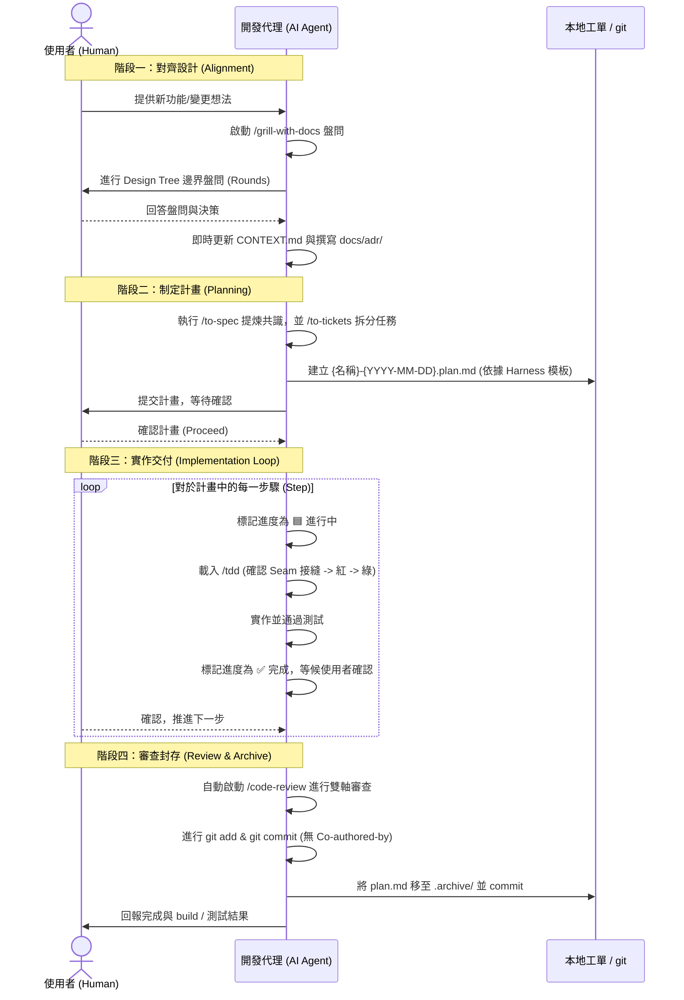

# 高階軟體工程實作工作流（Matt Pocock Skills × Harness 本地規範）

> [!NOTE]
> 本檔案為 HARNESS 制度庫的獨立擴充子檔案。用於提供一套包含「需求磨礪 (Grilling)」、「領域建模 (Domain Modeling)」、「規格拆解 (Spec & Tickets)」、「測試驅動開發 (TDD)」與「雙軸審查 (Code Review)」的端到端進階工作流程。
> 原有 `HARNESS/rules/workflow.md` 保持不變。

---

## 觸發條件
* 使用者要求進行高階軟體工程重構、複雜功能開發（跨多檔案/多模組）。
* 使用者在會話中提及「高階工作流」、「設計對齊」、「雙軸審查」或使用 `/mattpocock-workflow` 指令。

**與 [rules/workflow.md](workflow.md) 的分工**：兩者觸發條件在「多檔案/多步驟」上有重疊，預設先用
`rules/workflow.md`（單一 plan.md 追蹤）。只有當任務需要先盤問對齊設計邊界、TDD 紅綠切片、或雙軸審查時，
才升級到本流程——本流程是在 `rules/workflow.md` 的 plan.md 機制上疊加對齊/TDD/審查階段，不是另一套平行機制。

---

## 端到端執行流程

---

## 細部階段規範

### 階段零：前置技能檢查 (Pre-flight Check)
* **一次性設定檢查**：若專案尚未建立 `docs/agents/` 設定檔，應先引導執行一次 `/setup-matt-pocock-skills` 配置專案規範。
* **子技能檢查**：確認是否缺少所需子技能（`grill-with-docs`, `to-spec`, `to-tickets`, `tdd`, `code-review`, `domain-modeling`）。
* **若有缺少，必須主動打字詢問使用者選擇安裝範圍（Project 或 Global）**：
  - **Project**: `npx skills add https://github.com/mattpocock/skills -s <missing_skills> -y -a '*'`
  - **Global**: `npx skills add https://github.com/mattpocock/skills -s <missing_skills> -g -y -a '*'`

### 階段一：對齊與領域設計 (Alignment)
1. **磨礪對齊**：
   * 呼叫 `/grill-with-docs` 技能，使用設計樹與輪次盤問（Rounds），向使用者確認決策邊界。
2. **領域維護**：
   * 確定新術語後，立刻修改/建立 `CONTEXT.md` 作為純 Glossary。
   * 若涉及難以逆轉的權衡，於 `docs/adr/` 中建立 ADR。

### 階段二：制定計畫 (Planning)
1. **拆解工單**：
   * 使用 `/to-spec` 與 `/to-tickets` 將對話共識收斂為具體的實作步驟與相依性。
2. **建立 Harness `plan.md`**：
   * 複製 `HARNESS/plan-template.md`，檔名格式為：`{功能名稱(英文)}-{YYYY-MM-DD}.plan.md`。
   * 使用表格狀態欄（⬜ 待做 / 🟦 進行中 / ✅ 完成 / ⚠️ 阻塞）追蹤進度。
3. **確認啟動**：
   * 向使用者提交計畫書，需獲得確認後才開始實作。

### 階段三：實作與 TDD 循環 (Implementation Loop)
1. **動手前準備**：
   * 檢查 `.issues/` 目錄下有無對應的失敗紀錄，避免重複踩坑。
2. **步驟執行（每次只走一步）**：
   * 更新狀態為 `🟦 進行中`。
   * 載入 `/tdd` 規約：確認 Seam 接縫 -> 寫紅燈測試 -> 寫綠燈最小實作。
3. **維護樹狀結構**：
   * 任何檔案結構異動，同步更新 `@tree.md`。
4. **請示確認**：
   * 完成該步驟後，將狀態更新為 `✅ 完成`，提供 build 輸出證據，**停下來打字請示使用者確認**，才進行下一步。

### 階段四：審查、提交與封存 (Review & Archive)
1. **雙軸代碼審查**：
   * 計畫完成後自動啟動 `/code-review`。
   * 派出平行子代理：**Standards 代理**（比對 Coding Standards 與 Fowler 12 種 Code Smells）與 **Spec 代理**（比對 spec 要求與 Scope creep）。
2. **Git Commit 規範**：
   * 驗證 build 與測試通過。
   * 執行提交，**commit message 嚴禁包含 "Co-authored-by"**。
3. **封存計畫檔**：
   * 將計畫檔移入 `.archive/` 並 commit 封存。

---

## 變更紀錄
- 2026-08-09：建檔，作為 HARNESS 制度庫融合 Matt Pocock 技能庫的進階擴充工作流。
- 2026-08-09：補上與 rules/workflow.md 的分工說明；`skills/mattpocock-workflow/SKILL.md` 精簡為索引，
  本檔改為唯一權威 SOP 來源，避免雙份維護 drift；`HARNESS/CLAUDE.md` 路由表補上本檔一行；
  確認所需 7 個子技能（含 code-review 雙軸審查）已全域安裝於 `~/.agents/skills/`，非命名衝突。
